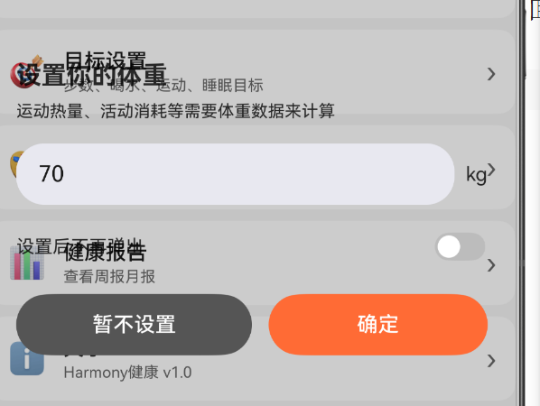

可以把主界面的心率这个东西删掉换成睡眠，现在不打算连接手环，有这个也没什么用（建议）
用不用把今日概览改成六个模块，和功能清单上面对齐（待讨论）
健康评分放上面是不是比较好（待讨论）
然后这个模块我认为把后面的步数运动睡眠信息删除，改成一个长条的进度条比较好看（待讨论）
快捷功能和更多功能这里的模块能不能加上自定以位置，比如可以长按然后拖动位置（待讨论）
应该把日记的这个功能放到日记那个界面加上增删改查的操作，不用放到第一个界面（待讨论）
识图的时候可以加一个加载的动画（建议）
我识图之后保存到自己食谱然后没有找到食谱，是不是我自己的操作有问题，之后找到了，建议在搜索下面经常搜索的食物，然后点击可以快捷加入自己今天吃的十五（待讨论）
通知这个界面可以移动到账号这个里面，感觉这个功能没有必要再单独一个界面，可以把这个位置放打算做的多模态AI（待讨论）
体重设置这个是不是要加一个弹窗的背景

，这个是不是bug（建议）
健康报告可以加一个每日得到的分数（建议）
把手环这部分直接删除（建议）
体重界面可以加一个柱形图来表示体重变化（建议）
增加睡眠记录入睡时间和醒来的时间应该分开（类似打卡的逻辑），比较符合平时睡觉的逻辑，有可能第二天睡醒的时候就忘了前一天什么时候睡的了（建议）
运动界面添加一个三元环分别是今日步数，站立次数，中高强度活动次数，然后设置一个运动按钮，点击按钮进入运动界面，实现之前的运动功能（建议）
个人信息这个地方是不是可以加一个

这种的条形图（建议）
还可以加一个深色还是浅色可以设置跟随系统默认（建议）